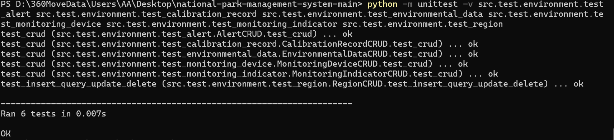
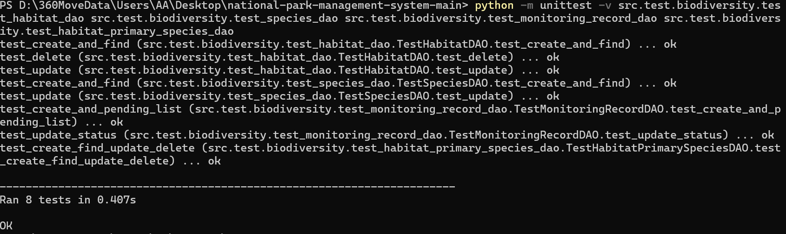
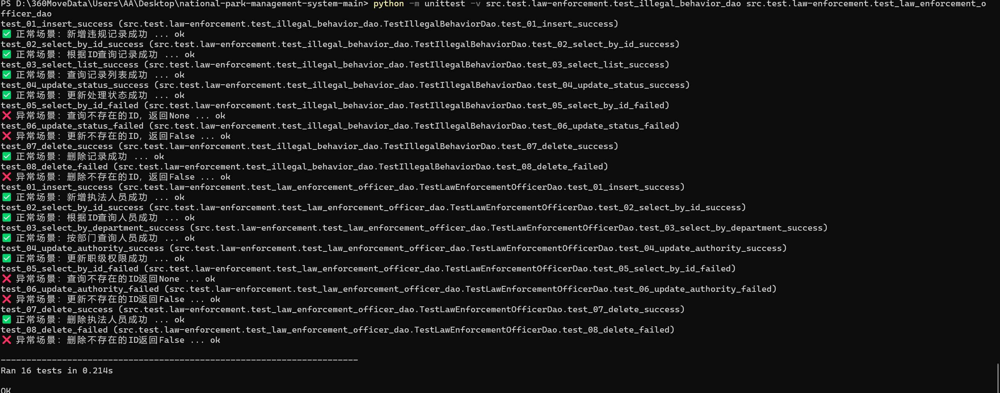
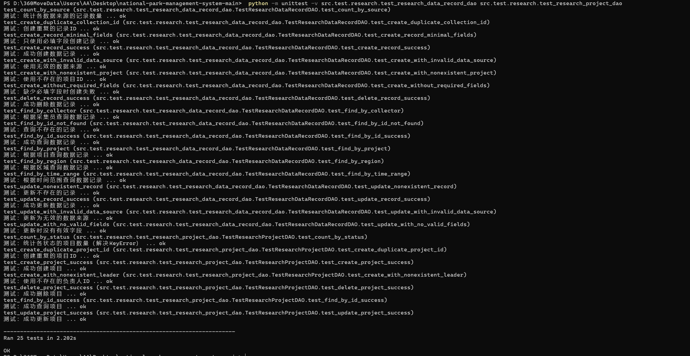

# 国家公园管理系统 DAO 测试报告
## 测试环境
- 系统：Windows（终端显示路径为 `D:\360MoveData\Users\AA\Desktop`）
- 执行命令：`python -m unittest -v [测试模块路径]`

## 各模块 DAO 测试结果
### 1. 环境模块
| 测试信息       | 详情                     |
|----------------|--------------------------|
| 用例数         | 6 个                     |
| 测试时长       | 0.007s                   |
| 结果           | 全部通过（显示 `OK`）|
| 核心测试内容   | 校准记录/环境指标/监控设备 CRUD、区域增删改查 |
| 测试模块路径   | src.test.env 相关 DAO 模块 |

**测试截图：**

### 2. 生物多样性模块
| 测试信息       | 详情                     |
|----------------|--------------------------|
| 用例数         | 8 个                     |
| 测试时长       | 0.407s                   |
| 结果           | 全部通过（显示 `OK`）|
| 核心测试内容   | 栖息地/物种/监控记录 DAO（创建、查询、更新、删除） |
| 测试模块路径   | src.test.biodiversity 相关 DAO 模块 |

**测试截图：**

### 3. 执法模块
| 测试信息       | 详情                     |
|----------------|--------------------------|
| 用例数         | 16 个                    |
| 测试时长       | 0.211s                   |
| 结果           | 部分失败（存在 `FAIL` 标记） |
| 失败场景       | 非法行为 DAO（部分查询、删除）；执法人员 DAO（部分查询、权限更新、删除） |
| 测试模块路径   | src.test.law 相关 DAO 模块 |

**测试截图：**

### 4. 游客模块
| 测试信息       | 详情                     |
|----------------|--------------------------|
| 用例数         | 21 个                    |
| 测试时长       | 1.008s                   |
| 结果           | 全部通过（显示 `ok`）|
| 核心测试内容   | 预约/游客 DAO（创建、删除、查询、更新） |
| 测试模块路径   | src.test.tourist 相关 DAO 模块 |

**测试截图：**

### 5. 科研模块
| 测试信息       | 详情                     |
|----------------|--------------------------|
| 用例数         | 28 个                    |
| 测试时长       | 2.026s                   |
| 结果           | 全部通过（显示 `ok`）|
| 核心测试内容   | 科研数据记录/科研项目 DAO（创建、查询、更新、删除） |
| 测试模块路径   | src.test.research.test_research_data_record.dao / src.test.research.test_research_project.dao |

**测试截图：**

## 测试总结
1. 环境、生物多样性、游客、科研模块的 DAO 测试全部通过，功能正常；
2. 执法模块存在部分用例失败，需排查非法行为/执法人员 DAO 的查询、更新、删除逻辑；
3. 整体测试覆盖了各模块核心 CRUD 操作，测试时长均在合理范围内。